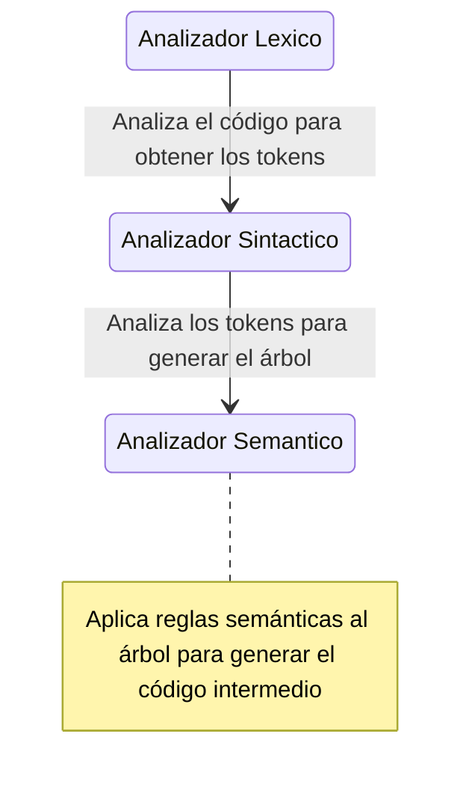

# Diseño del programa

Esta fase se divide en varias partes que son:
- Analizador Léxico ([lex.l](../lex.l)): En esta fase "tokenizamos" la entrada y definimos el significado de cada conjunto de caracteres en el código de entrada.
- Analizador Sintáctico ([syntax.y](../syntax.y)): En este archivo estan escritas las reglas y las acciones semánticas para cada una de ellas. Asi mismo, las acciones para generar Java bytecode se encuentran aqui.
- Código C++: Ambos archivos (el analizador lexico y el sintactico) eventualmente generan un binario en C++ que se puede compilar utilizando `g++` (ver apartado [ejecucion](../README.md#como-ejecutar-el-compilador)), por lo que en ambos archivos se puede colocar código C++ para optimizar y mejorar la generación de código.

## Estructuras de datos

`%UNION% {SYNTAX.Y}`

En Bison, la directiva union especifica una unión para cada tipo posible de terminales y no terminales.

Por ejemplo, para constantes de tipo `int`, ponemos allí el tipo en la unión como `int ival`. Luego definimos un terminal como: `%token <ival> INT_CONST`, y luego tenemos el terminal `INT_CONST` que tiene un valor semántico de int.

## Algoritmos

- **Expresiones condicionales**: En las expresiones condicionales primero se generan dos etiquetas para `True` y `False`, luego se envian a la expresión. Después, las dos etiquetas se imprimen antes de las dos declaraciones responsables de `True` y `False`.
- **Expresiones booleanas**: En las expresiones booleanas generamos el arbol usando los atributos heredados de `True` y `False`.

## Funciones de todas las fases

### Fase 1
Esta fase representa la construcción de un analizador léxico en un compilador. Toma las expresiones regulares para diferentes tokens en un lenguaje específico (ver apartado de [definiciones](./DEFINICION.md)) y produce un AFND (Automata Finito No Deterministico), luego este AFND se usa en el analizador léxico para coincidir diferentes tokens.

### Fase 2
Esta fase representa la construcción de un analizador sintáctico en un compilador. Toma reglas gramaticales y produce un analizador LL(1) para esta gramática. Dicho analizador toma los tokens del analizador léxico y produce el árbol de análisis.

### Fase 3
Esta fase representa el analizador semántico en un compilador típico. Toma el árbol de análisis y produce el código intermedio.

### Diagrama

El siguiente diagrama hecho en [mermaid](https://mermaid.js.org/syntax/stateDiagram.html) nos muestra las fases descritas

## Testing

A la hora de testear el compilador, se opto por utilizar [Jasmin](https://jasmin.sourceforge.net/), que es basicamente un ensamblador para la plataforma Java. En este caso es un lenguaje intermedio que podemos usar para escribir código Java en un formato más bajo nivel, similar a lo que se hace con el ensamblador (assembler) en lenguajes de bajo nivel como el lenguaje de máquina. 

En este caso, después de que Flex y Bison hayan realizado el análisis léxico y sintáctico del código fuente y una vez aplicadas las reglas semánticas necesarias, generamos código Jasmin que representa el código intermedio o el bytecode Java correspondiente al código fuente procesado. Luego utilizamos el ensamblador Jasmin para convertirlo en bytecode de Java, que luego puede ser ejecutado en la Máquina Virtual de Java (JVM).
